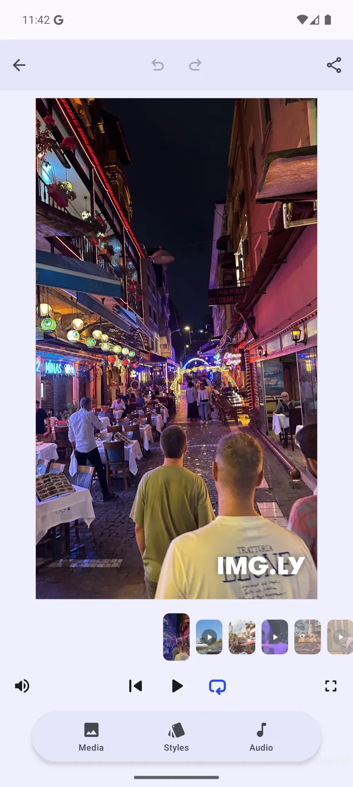

## Memories Editor Starter Kit in Android

  

The starter kit is built on top of the Creative Editor SDK.
Built to help people turn their photos and video clips into shareable memory montages.
A dock at the bottom of the editor provides quick access to the most essential tools, allowing users to add photos and video clips from their gallery, apply a style/look, and layer in audio, then arrange everything on a timeline before exporting an MP4.

### Repository Structure

- Repository is a fully functional Android project with `:starter-kit` and `:app` modules.
- `:starter-kit` library module encapsulates the implementation. Start at `MemoriesConfiguration.kt`
  (it wires the editor's `onCreate` / `dock` / `bottomPanel` / `navigationBar` / `overlay` / `onExport`
  slots). `MemoriesApp.kt` is the full flow (photo picker → slideshow editor).
- `:app` application module launches `MainActivity.kt`, which displays `MemoriesApp`.

### Where to change things

- **Slide animations** — `utils/Animations.kt`
- **Looks/filters (styles)** — `styles/VideoStyle.kt`
- **Timing, page size, title** — `utils/Constants.kt`
- **Timeline assembly** — `editor/SceneSetup.kt`, `editor/Timeline.kt`, `editor/Title.kt`

### Building The Repository

1. Clone the repository.
2. [Create and launch](https://developer.android.com/studio/run/managing-avds) a new android emulator or use an existing one. 
3. Open the local repository via `Android Studio` and click the `Run` button or go to the local repository via terminal and call `./gradlew installDebug`.

### Useful links

- [Starter Kit Documentation](https://img.ly/docs/cesdk/android/starterkits/)
- [CESDK Android Documentation](https://img.ly/docs/cesdk/android)
- [CESDK Android Source Code](https://github.com/imgly/cesdk-android)
- [CESDK Android Examples and Play Store App Code](https://github.com/imgly/cesdk-android-examples)
